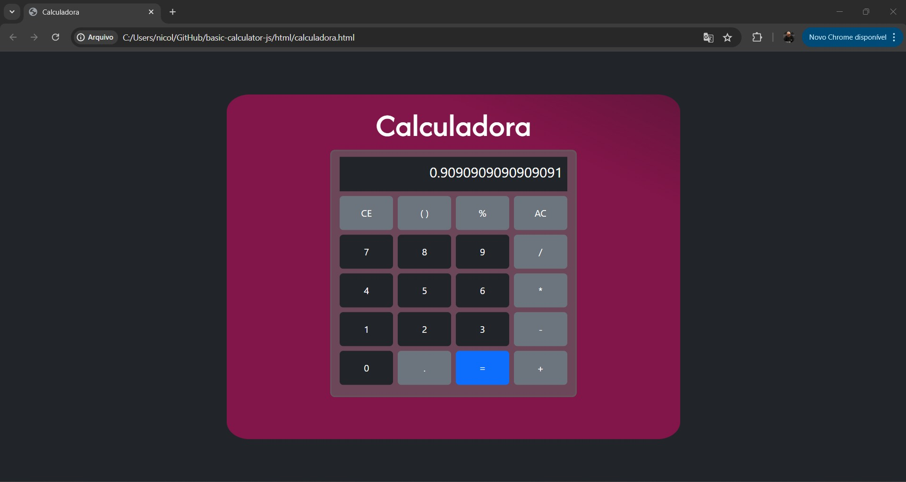

# Calculadora

Este projeto é uma calculadora simples que permite realizar cálculos matemáticos básicos e complexos, incluindo o uso de parênteses para organizar as operações. 
A calculadora suporta as quatro operações aritméticas principais (adição, subtração, multiplicação e divisão) e cálculos envolvendo porcentagens. 

# Tecnologias Utilizadas

* HTML
* CSS
* Bootstrap
* JavaScript

## Pré-visualização

